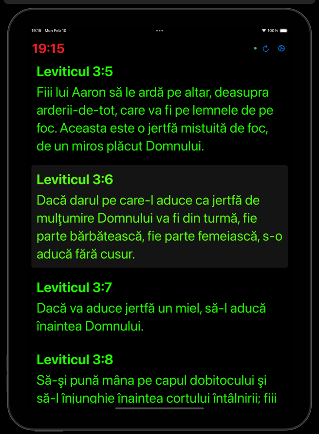
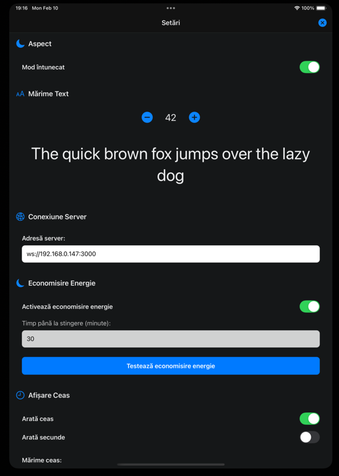
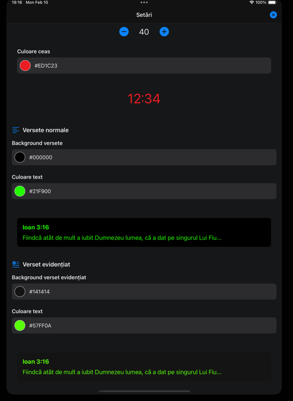

# BibleShow Presentation Mobile App

A React Native application built with Expo for displaying Bible verses in real-time sync with BibleShow software. This app was specifically designed for preachers to have a mobile view of the currently displayed Bible verse during their sermon, ensuring they stay in sync with what the congregation sees on the main presentation screen.

## Features

- Real-time Bible verse synchronization
- Dark/Light mode support
- Customizable text size and colors
- Power-save mode
- Offline capability
- iOS and Android support

## Requirements

- BibleShow 5 Beta or newer is required for the web server functionality

## Support

If you need help or have any questions, please email us at contact@radiocrestin.ro

## Screenshots





## Getting Started

1. Install dependencies:
   ```bash
   npm install
   ```

2. Start the development server:
   ```bash
   npm start
   ```

## Available Commands

- `npm start` - Start the Expo development server
- `npm run android` - Run on Android
- `npm run ios` - Run on iOS simulator
- `npm run ios:device` - Run on connected iOS device
- `npm run build:ios` - Build iOS IPA file locally
- `npm run web` - Start web version
- `npm test` - Run tests
- `npm run lint` - Run linter

## Building for Production

To build the iOS app locally:
```bash
npm run build:ios
```
The IPA file will be available in the `./builds/ios/` directory.

## Development

This project uses:
- Expo Router for navigation
- React Native Reanimated for animations
- Expo Haptics for tactile feedback
- AsyncStorage for local storage
- WebSocket for real-time communication

## Server Component

The application requires the BibleShow Presentation Server to be running for verse synchronization. See the `server/README.md` for server setup instructions.
